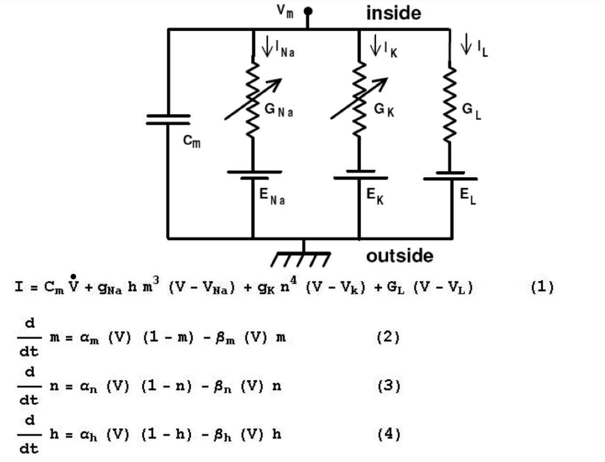

# Notes on Synapses, Neurons, and Brains

On October 18, 2023, I started on the course [Synapses, Neurons, and Brains](https://www.coursera.org/learn/synapses) with Professor Idan Segev.  Below are my notes on the course.  As always with notes, expect lots of abbreviated language and shortcuts.  I also have some much more preliminary [Review Notes](SynapseseNeuronsAndBrainsReviewNotes).

## Week One

Some dramatic billion-dollar projects include:
	* Allen Institute Seattle - Mouse/Human Brain Atlas
	* [Janelia farm](https://www.janelia.org/) - DC, USA 
	* EU Human brain project
	* President Obama's "Brain Activity Map" initiative

### Five exciting things:
* Connectomix (see also [Wikipedia article](https://en.wikipedia.org/wiki/Connectomics))
* Brainbow
* Brain-machine/Computer Interface (BMI)
* Optogenetics
* Computer Simulation of the Brain (e.g. Blue Brain Project)

Camillo Golgi and Santiago Ramon Y Cajal are "The Two Giants", the beginning of modern neuroscience.   Golgi stains actually only stain about < 1% of cells, so doesn't make tissue dark, you can then see those stained neurons (a later term).  1906 Nobel Prize.

### Connectomics

Connectomics is modern anatomy wiring diagram -- cut very thin slices (nanometer resolutions).  Electron microscope used for this.  Detect slice structure separately, then reconnect slices.  So it's 3D mapping, so far done on pieces of brain, not whole brain.  

Prospects for connectomics is to give us a complete blueprint of healthy and sick brain, and we may start to bridge the "structure-to-function" problem, and get into simulation-based research.

### BrainBow

Genetic staining of neurons in vivo (light microscope -- micrometer resolution).  Harvard messing with mice genes, inserting pieces of DNA, when DNA is expressed, some cell types become colorful because of floursecent proteins (hence Brainbow).  By the way, synapses are too small for this resolution, but can see general placement of neurons.  Lot of art exhibitions based on this.  

Prospects of this are 1) structural basis for learning; 2) taggging and genetic characterization of different cell types, eg. in retina, or find out how many cell types you have 3) Tracing connections in circuits, short and long range.

### Brain Machine Interface

Electrodes implanted and listening to a single cell's spike, or a large group of cells.  Spikes are the common language.  Talks to an Artificial Neural Network, and then to a robotic arm.  Or can go the other way to ameliorate parkinsons, pulses from battery into basal ganglia.  Basically a pacemaker for brain.  Future challenges are 1) to be able to telemetrically record from within the brain without invasive electodes 2) real-time signal analysis. 3) Close the loop for movement with touching.

### Optogenetics

Idea is to tweak the genetics of cells to plant probes that are sensitive to light, so you can shine light of particular wavelength and have it generate a signal.  In nature, only retina is sensitive to light.  But existence of retinal receptors means there are genes that can code for molecules that are sensitive to light.  With two examples.  Ion channel Rhodopsin spikes when blue light shines on it. C.f. [Rhodopsin](https://en.wikipedia.org/wiki/Rhodopsin).  Other example Natronomas pharaonis, yellow light prevents spikes.  Movie from Janelia Farm (aka now Janelia Research Campus), can induce mice to drink with blue light on certain group of cells.

### Blue Brain Project - Brain Simulation

Computer simulation (modeling) of neural circuits.  Lord Kelvin (William Thompson) quote:
"I am never content until I have constructed a mechanical model of the subject I am studying. If I succeed in making one, I understand; otherwise I do not." [BL]

Uses powerful "[Blue-Gene](https://en.wikipedia.org/wiki/IBM_Blue_Gene)" IBM computer.  Blue as in Big Blue, IBM.  Modeling is writing equation to describe types of spikes for certain class of cells.  Different equations for different spike (ultimately cell) types.

Modelling helps us to understand the network (e.g. by visualizing model in action).

So this is "simulation-based medicine [or s-b research]"

## Week Two

### The Neuron

* The neuron
* The axon
* Dendrites / dendritic spines
* Neuron types
* Synapses
* Electrical signals
	* Spike (action potentitial)
	* Post-Synaptic Potential (PSP)
* Neuron as I/O Device

Historical perspective first, Hooke, Schwann, Golgi, Ramon Y Cajal, ... and interestingly, Sigmund Freud (drawing crayfish neurons).  

Nice images from Blue Brain, also videos of activity of living brain.

### The Neuron Doctrine

Controversy between Camillo Golgi and Santiago Ramon y Cajal (RyC). Ramon y Cajal originally an artist.  Looking through primitive microscope at different parts of nervous system in different animals, using Golgi staining method.

RyC by looking at anatomy only, conceived that information flows through axon, to and then to dendrites.  Could not really see communication, drew arrows showing information flow, then thought from dendrite to cell body, to axon, to dendrite of next neuron.  So theory that we're dealing with individual cells is the neuron doctrine.  The theory of dynamic polarization is that the receiving dendrite is somehow polarized, then flows to body, then axon.

N.B. RyC:

	* Dendrites are the receptive devices (Input).
	* Axons are the sending (output) devices.

We agree with this.  Golgi did not like this -- thought they were all connected physically.  1906 was a debate at the podium for Nobel prize. 

Both axons and dendrites look like trees, axonal trees, dendritic trees.  Axonal trees have varicosities (boutons) -- this is where the neurotransmitters send the signal.  Sometimes one axon will have 5,000 synapses

### The neuron as an input / output device

**NB:  Really important introduction**

NOTE:  This [video lesson](https://www.coursera.org/learn/synapses/lecture/97K4b/the-neuron-as-i-o-device-part-i) has an excellent abstracted image associated with it.

Many (like up to thoushands) of axons (synapses) connect to one dendrite.  Make little change in voltage, local synaptic potential.  Certain types of cells (red in picture) make positive voltage (excitatory), the other ones are inhibitory.  All together they sum the input, and the cell "decides" whether to generate an output yes or no.  Output if there is one will be a set of spikes, tak tak tak etc.

Image too of pyramidal cell from cortex.

### The Axon

Just after the soma, axon initial segment (AIS), hot region generating spikes.  Consists of special ion channelss that make this region hot, i.e. enables generation of spike.  This is where action potential starts, then it propagates down the axon, to all axon branches.  Between axon segments are nodes of Ranvier. Between nodes of Ranvier are inter-nodes, with myelin sheath.  Nodes of ranvier don't have myelin sheath.  Myelin is a lipid, it electrically isolates axon.  Terminals of axon are pre-synaptic sites, boutons or varicosities; up to 5,000 per axon.  No myelin on varicosity -- it's "bare wire".

Myelin internodes generated by special set of non-neuronal cells.  These are sometimes called glial cells, or have other names too that aren't worth remembering but are oligodendrocytes.  Electrical potential gets boosted in nodes of Ranvier.

Note that dendrites never have myelin.

By the way multiple sclerosis is a disease where the immune system attacks the myelen sheath, and messes with the signal flow.

Nodes of Ranvier amplify (boost) signal.

Summary:

* Axon is highly branched structure emerging from soma.  Can branch locally or go centimeters or even meters away from soma.
* Starts with hot axon initial segment, where spike starts, then it propagates along axon.
* Covered with myelin, except in nodes of ranvier, where there are hot ion channels
* Has frequent swellings (boutons), where the neurotransmitter "hides" (pre-synaptic site).

Most importantly, axon is an output electrical device.  It generates and carries electrical signals called spikes.

### The Dendrite
10/20/2023

Pictures of dendrites (links below to 3rd party resources)

* [Purkinje cells](https://en.wikipedia.org/wiki/Purkinje_cell) from cerebellum, "small brain".  Flat, bush-like.
* [Starburst amacrine](https://en.wikipedia.org/wiki/Amacrine_cell) retina cells.
* [Pyramidal cell](https://en.wikipedia.org/wiki/Pyramidal_cell) -- common in hippocampus; pyramidal structure (triangular looking) cell body.

Point here is name of cell often depends on structure of dendritic tree.

RyC drawing shown pyramidal cell, with small branches, dendtritic spines, so this type is a spiney dendritic tree, and these spines are "where synapses are made onto".  Pyramidal cells are spiney.  Sometimes 10,000 spines per pyramidal cell.  On his death bed RyC was drawing spines.

Typical number for pyradimal cell in cortex: 

* total area 20,000 square micrometer [(= micron).  One millionth of a meter]
* each spine has area of 1 square micrometer of dendritic spines per cell, 8,000, average.  But could be 30,000 or more.
* Listen to 10,000 synapses

In cortex, in terms of area, 50-60% of brain area is dendrites.

Pictures of human pyramidal cells from cortex.  Showing apical tree (point of pyramid) and basal tree (again see [Pyramidal cell](https://en.wikipedia.org/wiki/Pyramidal_cell)).

Takeaway:  cortical pyramidal cells have dendritic spines.

### Neuron Types

Can classify by:

* Anatomical features (e.g. "face" of dendrites and axons)
* Functional, .e.g. excitatory (principle) vs inhibitory (interneurons) -- balance between two is very important, by way.
* By electrical spiking pattern.  Some cells fire more or less, different patterns.
* By chemical characteristics.
* Using gene expression

Count of neurons in human brain:  a number close to 100 billion.

Work on this is not final.  # of types not final, depends on classification, but could say several thousand types overall.

Example (detail on point 2), in neocortex, principle (excitatory cells) have long axon that projects to other brain regions, whereas interneurons (inhibitory) have local axonal projection.

2013 work by Javier DeFelipe to classify inhibitory neurons, Chandelier, large baskent, horse-tail, Cajal-Retzius, etc. etc.  Depends largely in differences in dendritic tree or sometimes axonal structure.  Why different structures an interesting question.  [I also wonder if this needs to be modeled for an artificial (ANN) human.]

Slide of electrically-based (spiking) classification.  Some fire a lot (regular).  Some "stutter".  We don't understand the structual reason for this.

### The Synapse

The synapses is a chemical / electrical device that connects axon of neuron A to dendrites of nueron B.  Pictures of very close axon - denrite connections.  Single pre-synaptic cell can make contact at several locations to the same post-synaptic cell.  Using electron microscope, can see axon bouton (pre-synaptic) connecting to dendritic spine (post-synaptic). They don't physically touch, but very very small gap.  

Side note when axon connecting to spiny dendrite, this is typically excitatory type connection.  Electron microscope view showing showing axon A with small vesicles, a very small gap, and a dentridic spine, B  -- vesicles contain neurotransmitter, e.g. 5,000 molecules of glutamate, acytlcoline, or seratonin.  So vessicles live in axonal varicosities (boutons).  Neurotransmitter travels through gap to dendrite spine.  Spike is digital, all or none.  When spike arrives, secretes the neurotransmitter -- spike is the trigger.  Post-synaptic, you'll also see a signal too, "excitatory synaptic potential".  So two types of activity:

* Action potential (from axon)
* Post-synaptic potential (could be excitatory or inhibitory)

Major difference is action potential is digital signal.  The post-synaptic potential is graded, analog signal [this reminds me of how ANNs are modeled?].  So digital signal on one side to analog on other side. So digital-to-analog converter.

Slide on synapse vesicle quantal release.  

### The Neuron as Output Device: Part 2

Summary of Lesson 2

* Different cell types.
* Excitatory input can come from very far away, e.g., thalamus to the cortex.
* Cell may receive 1500 synapses from neighbors, 360 from thalamus, etc.
* Now reshow important diagram
* In the receiving cells, have Excitatory post-synaptic potentials (EPSPs) and Inhibitory post-synaptic potentials (IPSPs) -- eventually all gets summed up in the cell body, may reach threshold for action potential generation.

First quiz first attempt got 92.85% on attempt one, 10/21/2024

## Week Three - Electrifying Brains -- Passive Electrical SIgnals

### The Cell as an RC Circuit

Today starting with passive properties.  Already mentioned, pre-synaptic we have action potential, digital, all or none.  In this lesson we're talking about next part, the synatpic potential, in the dendrite.  So in week 3: 
* link anatomical structure to idea of passive-RC circuit.  
* talk about membrane, and the membrane time-constant (Tau-M)
* Temporal summation of repeated inputs -- "electrical memory"
* Generation of post-synaptic-potential (PSP) in post-synaptic membrande
* Continue talking about excitatory (E) and inhibitory (I) synapses.
* E & I interaction

Start with a small patch of membrane, can wrap it into a sphere.  We'll place an electrode, and record dif between inside and outside of cell (voltage).  If we inject a positive current into cell, I (current), if you do this you see a voltrage change (V), the voltage change doesn't look square like current we injected, but it grows over time as a smooth curve, also slowly drops when current stopped.  So cell is not a mere resistor, because if it were, and you injected I, you would get a voltage that consists of I x R.  (Ohm's law - V = IR).  Not like that, it takes time t to grow, and also to decay.  We call curved response to I, we get a [depolarizing current](https://en.wikipedia.org/wiki/Depolarization), i.e. becoming less negative.

When people saw this, they though that a cell that acts like an [R-C circuit](https://en.wikipedia.org/wiki/RC_circuit).  If you inject I into such a circuit, it takes time to grow, and when stop injecting current, takes time to go back to baseline or zero.  So RC circuit is a good approximation of such behavior.

### The voltage equation for the passive cell

The math for an RC circuit, want to again measure V (voltage) in response to current (I):

Total current is either resistance current or capacitance current.

$$ C\space\frac{dV}{dt} + \frac{V}{R} = I $$

So capacitative current + resistance current is equal to Current (I).

This is basicall [Kirchoff's Law](https://en.wikipedia.org/wiki/Kirchhoff's_circuit_laws#Kirchhoff's_voltage_law)

If you solve this equation for V you get behavior of cell, solution is linear because C is constant, resistance is constant, current input (I) is constant.  end up with dv/dt as a solution, which is a derviative, so shows change over time.

Initial conditions, V (t = 0) = 0, and up with some V after certain time.

$$ V(t) = I*R\space\space(1 - e^{\frac{-t}{RC}}) $$

At t = 0, e to zero is one, 1-1 = 0, so V(t = 0) = 0, or

$$V(t = 0) = 0$$

If inject current for infinite time, e to power of -t goes to zero, so IR * (1 - 0) = IR so 

$$ V(t = \infty) = IR $$

This last is steady state.

So these are two ends.

### The Membrane Time Constant

This time we want to look at $ t = RC $.

By the way, RC is many times called tau,

$$ \tau $$ 

or sometimes

$$ \tau_{m} $$

i.e. tau membrane.

Looking at t = RC = Tau, what is value of V.  Well ends up being 

$$ 1 - e^{-1} $$

So 

$$ V(t = \tau) = IR * (1 - e^{-1}) $$

The one minus e to the -1 is = .63, so

$$ V(t = \tau) = .63 IR  $$
 
$$ IR = \infty $$

Can use same equation to ask how will voltage decay (attenuation) when we stop the current.  So still exponential, but not 1 - exponent, just exponent.  Attenuation like build-up.

Tau-M is caled the membrane time constant (very important).

Attenuation function is 

$$ V(t) = V * e^{\frac{-t}{\tau_{m}}} $$

Growth and decay are mirror images of one another, goverened by Tau-M, the membrane time constant.  It governs how fast the voltage develops / attenuates.  If time constant long, will take a long time to attenuate, and vice versa.  (earlier I believe he said RC (tau) in seconds).

This constant in effect tells you about the electrical memory of cell.  Short means it "forgets" quickly.

Another important parameter is R, sometimes called

$$ R_{in} $$

R input, or input resistance.

R directly tells you maximum voltage you can reach for a given I.  RC tells you how fast go up and down.

So critical parameters for passive RC circuits are:

* R 
* RC

### Temporal Summation

An important consequence of time constant, what if inject an intermittent current, not a constant one.  So I is intermittent.  Voltage goes up and then attenuates, but not all the way down, so following second period of I, get a buildup on top of remainder of previous one.  This is called temporal summation.

If would have done it constantly, would have gotten a larger buildup.  IR is maximum you can get.

Next shows negative current, here voltage will be pushed down.  The name for this [mentioned in passing] is [hyperpolarization](https://en.wikipedia.org/wiki/Hyperpolarization_(biology)).  (When cell gets more positive, it's called depolarization, or hypopolarization).

This temporal summation of positive and negative current is "exactly what synapses are doing".

### The Resting Potential

Now back to cell membrane (circle) near R/C diagram -- this is the "Passive Membrane Model".  

New:  When you implant the electrode into the cell, suddenly see a drop in voltage.  I.e., cell is more negative than outside, so drop in voltage is from zero to "something like -70 mV" (millivolts).

So inside of cell is about 70 mV more negative than the outside of the cell. This is called the resting potential, i.e., with no current.  This negative charge inside requires energy to maintain.  In any brain, inside is more negative, so because of this we need to add a battery to the original RC circuit.  (This appears to be a good [related article](https://www.cns.nyu.edu/~david/handouts/membrane.pdf)).

Resting potential symbol:

$$ E_{\space rest} $$

Again:
	More positive:  Depolarization
	More negative:  Hyperpolarization

Next stage is to speak about synapses, which can add this current....

### The Synaptic Potential, Part I

Up until now we've dealt with passive proprerties of cell, resting potential.

BTW, ballpark values for R * C, Time constant, = Tau, of on the order of 20 milliseconds

Brief review of synapse, vessicles of axon meeting receptors of dendrite -- what happens when neurotransmitter interacts with receptors.  We get new ion channels opened in the receptor, which enable the flow of current, either from out -> in or from in -> out.  So on the dendrite side eventually, result of neurotransmitter uptake is new ion channels.  Channel behaves like a conductor or a resistor, we call it 

$$ g_{\space syn} $$

Wait -- now talking about it as a battery for the synapse:  

$$ E_{\space syn} $$

### The Synaptic Conductance

Looking at dendritic side membrane, earlier said two types of channels. 
* One type is passive type that, in total, represent the R value (resistance) in the cell.   ("white channels" for purposes of drawing)
* Other type ("red channels" for purposes of drawing), when synapse interacting w/ neurotransmitter.  These then are synaptic channels.  

We represent the conductance of these with 

$$ g_{\space r} $$ 

for the r (resting channel), passive resistance, and

$$ g_{\space s} $$

for the synaptic channels.

Red channels only open in response to reaction with a neurtransmitter.  Collectively they result in something called the synaptic voltage.

But we need to also discuss the Synaptic Battery (next)

### The Synaptic Battery

Difference in ion concentration is a general property of living cells.  In particular in nerve cells.  For instance, outside nerve cells there are a LOT of (positive +) sodium channels, and much fewer inside cells.  In case of potassium, opposite is true, lots inside, less outside.

If you open a particular sodium channel only, because of concentration gradient, you will get positive flow into the cell.  So will get depolarization, John says -- and professor says a second later. :)

So calling it a battery is a way of representing the flow of ions.

For potassium, because there is more inside, it will flow from inside -> outside, so you will lose positive charge, so cell will become hyperpolarized.

### The Synaptic Potential, Part II

So, again:
* Post-synaptic membrane has both passive channel and synaptic channel.
* Specific ion channels get opened, allows current to flow either in or out.

Circuit has $ g_{\space r} $ (g-rest), resting conductance plus resting battery, $ E_{\space r} $, the whole -70 millivolts -- this is the passive part of circuit.

Synaptic part is $ g_{\space s} $ synaptic conductance plus $ E_{\space s} $, synaptic battery. 

Equation before was $ C \frac{dV}{dt} + g_{r} (V - E_{r})$  First part is capacitative current, second part of that is passive current.

Now equation with red current (synaptic part):

$ C \frac{dV}{dt} + g_{r} (V - E_{r})  + g_{s} ( V - E_{s}) = 0 $  

Last term is synaptic current.  Sum of all terms in above equation = 0 according to kirchoff's law.  You can solve this equation to get that last V -- the voltage generated by the synapse.

### The Voltage Equation for the Synapse and EPSP and IPSP

Again, the current equation is:

$ C \frac{dV}{dt} + g_{r} (V - E_{r})  + g_{s} ( V - E_{s}) = 0 $  

If solve it for V -- the voltage change due to activity of synapse, you get this equation:

$$ V(t) = \frac{g_{r} \space E_{r} + g_{s} \space E_{s}}{g_{r} + g_{s}} \space (1 - e^{-t \frac{g_{r} + g_{s}} {c}})$$

There is a ceiling to positive or negative synaptic battery.

Reasonable range is something like +200 millivolts to -90 millivolts.  Whole world represented by signals in this range. :)  If voltage goes up, it's EPSP (Excitatory Post-Synaptic Potential). If it goes down, it's IPSP (Inhibitory Post-Synaptic Potential)

### Summary 

EPSP and IPSP diagram, we have time consant -- if both at both time, have temporal summation.

Quiz for this one done on 10/25/2023, got this nice little encouragement along with a 90% grade:

## Week Four:  Electrifying Brains - Active Electrical Spikes

### The Hodgkin Huxley Experiments

Now talking about active signals -- the spike!  The all or none, digital phenomenon that comes from the axon. This again is the action potential (axon) -- as opposed to resulting synaptic potential in the dendrite.

Outline:

1. The excitable ("spiking" axon)
2. The Hodgkin & Huxley experiments (Two giants)
3. Space clamp and voltage clamp
4. Membrane conductances/currents underlying the spike
5. Hodgkin & Huxley model for spike initiation (math. model)
6. Spike propogation along axon
7. From synapses to spikes

Two giants:  Sir Alan Lloyd Hodgkin and Sir Andrew Fielding Huxley -- both working in Cambridge before WWII.  Nobel prize 1963. They used the squid as an experimental animal.  Squid has unique property -- a giant axon, that's about 0.5 mm (500 micrometer) wide.  (Axons in brain on the order of micrometers -- too small to work on)
This allows you to place an electrode (the long way, like a catheter).  Published first view of spike (on oscilloscope) in 1939, by electrically signalling the cell.  Needs stimulus strong enough in depolarizing direction.  Starts from resting potential.  Goes up, then goes back down below resting potential (but gradually creeps back up).  Spike is about 1 millisecond long.

This is a universal activity of nerve cells.

Wrote beautiful set of 4 equations in several papers (1952).  Now we understand action potential in a very compact way.  "I see it as a triumph of theory.  Actually I don't think that today we have such a beautiful theory in neuroscience as the Hodgkin/Huxley theory for the spike."

### Membrane Currents Underlying the Spike

Example of a votage clamp -- now changing voltage (Hodgkin and Huxley) by a fixed amount.  So there is a voltage change.  Behaves like a passive RC current -- nothing new -- if depolarizing current is sub-threshold.  If depolarize further, "For suprathreshold depolarizing voltage clamp, the recorded membrane current (after the first capacitative current) flows first inwards (into the axon) and later outward (from inside to outside)." -- this is a surprise.  First see capacitative current as before -- as you hold voltage -- see first an inward current into the axon, then curves up.  Remember, voltage is fixed, but then get inward then outward current.  

Found that if you used drug, tetrodotoxin (TTX), a fish toxin, if put it on axon, the inward phase disappears, left only with the outward phase.  With tetraethilammonium (TEA) -- now the outward current gets blocked, but leaves inward.  What they found by playing with Na and K concentrations, that inward was Na and outward was K.

Found sodium current was inward current (fast -- happens early on) -- then changes to potassium current later (outward current).  Outward current continues if continue voltage clamp. In 1954D paper by Hodgkin / Huxley, circuit diagram of squid axon.

Have Capacitive current + Early sodium current + later potasium current + leak current (resting state cell is negative).

### Modeling the Membrane Currents

$$ I_{K} = g_{K} (V_{m} - E_{K}); \space \space I_{Na} = g_{Na} (V_{m} - E_{Na})
$$

I.e. for first one, membrane voltage minus the potassium ion battery times the conductance = the current.  Same for sodium.  In voltage clamp case, we fix $ V_{m} $.  Can try different values of $ V_{m} $m, measuring conductance of potassium and sodium.  Important:  Degree of conductance depends on voltage.  Get more conductance of both depending on voltage.

Summary:

* The slow (K) current (conductance) does not inactivate during voltage clamp (VC)(outward).
* The K conductance rises slower than it decays at the end of VC.
* The fast (early) Na conductance inactivates during VC.

H. & H. fitted an equation.  The fact that it grows slower and attenuates faster, rising phase described as function
$$ (1 - exp(-t))^{4} $$
and the decay as 
$$ exp \space (-4t) $$

So then they wrote this equation:
$$ \newcommand{\overbar}[1]{\mkern 1.5mu\overline{\mkern-1.5mu#1\mkern-1.5mu}\mkern 1.5mu} $$
$$ g_{K} = \overbar{g_{K}}^{n^{4}} $$

Right hand side, "g-k-bar", is maximum conductance, but actual conductance depends on term n -- which is the voltage.  When it's zero, no potassium conductance. When n = 1, you get maximum conductance since $ 1^{4} = 1$  Can also say n repesents the proportion of K-ion channels in the open state.  Tried to relate that 4 to the number of ions are in a certain region of the membrane.

### The H&H Spike Model

Talking about potassium channel.  Can think about $ n^{4} $ as having four gates. Need to move all 4.  Say zero means it's closed.  Can think about n as a probablity, because in range 0-1.  So probablity must be n = 1 to get to all of them to open. 

Already saw activation function:

$$ g_{K} = \overbar{g_{K}}^{n^{4}} $$ 

The rate function that $ n $ depends on in turn is 

$$ \frac{dn}{dt} = \alpha (1 - n) - \beta_{n^{n}}$$

Basically this says you move from open state to closed state as a function of both voltage and time.  $ \alpha $, if big, shifts close state to open state, and $ \beta $ shifts shifts open state to closed state.   $ \alpha $, becomes larger with voltage $ \beta $ becomes smaller with voltage. 

Sodium equation a bit more complicated. 

$$ g_{Na} = m^{3}h\overbar{g}_{Na} $$

$$ \frac{dm}{dt} = \alpha_{m}(1-m)\space-\space\beta m^{m} $$

$$ \frac{dh}{dt} = \alpha_{h}(1-h)\space-\space\beta h^{h} $$

First means that $ m $ opens the channel very fast, but $ h $ closes the channel more slowly.  Two differential equations that follow show how m and h change with time.  Because now dealing with $ m^{3} $, sodium channel has (schematically) three gates.  m gate opens early but h gate closes the channel but slowly. 

Now can see that this prediction and math by H&H, now know that there are parts of channels that are voltage sensors, m fast and starts it, h slower and turns it off.

When you solve equations for V, which appears in quite a few places, you can graph the spike that you actually see.  Since values are voltage dependent, e.g. for sodium, as voltage increases, this opens up channel even more.

Variable notes (mine):

* $ m $ - Sodium activating variable
* $ h $ - Sodium de-activating variable
* $ n $ - Potassium activating variable

At same time that start with de-activation of sodium with h variable, also get activation of potassium with the n variable.  So it's an extra help to hyperpolarization.  (Hence overshoots below baseline).

#### The Refratory period:

You can't get a second action potential very early after first one -- have to wait enough time.  It's about 10 milliseconds for full action potential.  So maximally, 100 spikes per second.  This is an experimental finding.  H&H explained it with behavior of both $ h $ (inactivation) variable and the potasium conductance.  Both h and K conductance are slow.

Can see spikes in any nerve cell, e.g. squid (as we've discussed), or cortical pyramidal cell.  

In living cell, this is a result of cell being de-polarized enough by voltage received from synapses of up 10,000 dendrites (if not too many inhibitory cells).

Note: This one was the toughest quiz so far and the only one yet that I've had to re-do.

## Week Five - Neurons as Plastic/Dynamic Devices

### Outline and Introduction

1. Fast examples
2. Purpose of learning ("action perception loop")
3. Functional plasticity (learning w/o anatomical changes)
4. Structural plasticity (where anatomy does change)
5. Discussion on memory:  Embedding memories.  Copy memories?  Is it reliable?

New thing 2013 Nature Karl Deisseroth et al published, "The Clarity Method".  Idea to develop methods to make whole brain transparent.  c.f. [Bringing Clarity to Brain Research](https://www.youtube.com/watch?v=LJ4PA1Gkhkg) video.  Remove coating of brain and stain different cells different colors, make it transparent and "fly around" in it.

Aristotle quote on memory -- not groundbreaking. :)

What changes in brain when you learn.

Some ambiguous or not clear images shown -- teach you how to interpret them.

Amir Amedi - Hebrew University -- Sensory substitution for the blind.  Can we use sound?  

Learning [looks like this slide is on Machine Learning] enables us to:
1) Generate useful predictions.
2) Categorize the world ("faces", "cars", etc.)
3) Create consensus among us for successful interaction.

Movement essential for perceptual learning ("action-perception" loop) - active cat vs. passive cat.  (Held & Hein experiment).

### Mechanisms Subserving Learning and Memory

The brain reconstructs reality from minute/very partial information (e.g. cochlear implants).  In this case, get strange noises in your ear, but you can interpret it.  Brain has to reconstruct it.  

Also true of vision, for example.

Now, brain mechanisms supporting functional and structural plasticity.  How does what we've learned feed into this.

We start again with Santiago Ramon Y Cajal.  Believed that nerve cells do not multiply [not correct], so he believed that learning resulted in more dendritic processes and axonal "colllaterals" -- so important point is more ***connections***.  Thought cerebral cortex like "a garden filled with trees, the pyramidial cells, ... multiply their branches ..."  

Hippocampus very very important for learning and memory.  Looks like a sea-horse [sort of], hence, hippocampus.  But not only this -- also study the cortex.

#### Possible neuronal mechanisms underlying learning & memory:

1. New nerve cells grow - new functional neural networks relate to new items (structural plasticity).  Cajal didn't know aobut this.
1. New synaptic connections (structural plasticity).  Ramon Y Cajal believed this.
1. Strength of existing (synaptic) connections change, becoming stronger or weaker -- functional plasticity.  (Donald Hebb)

### Functional Plasticity

The Hebb Hypothesis:  (Donald Hebb 1949 -- likely [here](https://www.amazon.com/Organization-Behavior-Donald-Hebb/dp/0471367273/ref=sr_1_4?crid=3MBOLLMQKJ83F&keywords=Donald+Hebb&qid=1698781531&sprefix=donald+hebb%2Caps%2C86&sr=8-4))
	*"When an axon of cell A is near enough to excite cell B or repeatedly or consistently takes part in firing it, some growth or metabolic change takes place in one or both cells such that A’s efficiency, as one of the cells firing B, is increased"*

aka "Fire together/wire together"

Subsequent investigation has shown that Hebb's rule is indeed implemented at some (hippocampal and cortical) synapses.  So synapse is highly plastic device.  So after learning, for example, for same spike (axonal) get stronger EPSP (Excitatory post-synaptic potential) in dendrite of cell B -- more depolarization.  E.g. insertion of additional receptors to post-synaptic membrane.  More ion-channels post-synaptically.  Could also do pre-synaptically, same spike could release more transmitters.

Now we can add electrodes to both cells and try to figure out mechanism.  Doing this led mainly in 1990s to ***Spike Timing-Dependent Synaptic Plasticity*** (STDP).  If generate with electode pre-synaptic (A cell) spike and post-synaptic (B-cell) spike, enough times, then you get a larger EPSP as in last paragraph.  Depends on timing between pre-synaptic and post-synaptic spike.  We call result, Long-Term Potentiation (LTP) -- for hours, days, lifetime.

If reverse order of timing (B then A) then you can make the connection weaker.  Called LTD -- Long Term Depression.  See this in Slide based on Dan and Poo work in rat visual cortex, 2006, curve trending downward.  Trends upward if A then B.  Also shows smooth curve based on time (timing dependent).  For times > +/- 40ms, no effect.  Incidentally, this doesn't explain the Pavlov case since bell/food could be seconds away.

We can write the equation for LTP/LTD.  Really blurry slide.

### Structural Plasticity

"Morphological/anatomical changes that are correlated with learning"

Here talking about dendritic spines, it seems.

1967 - Globus & Scheibel [one of many experiments].  If cover eyes (visual deprivation) of an animal (cat? rabbit?), you see changes in the density of the spines.  

In response to learning, see increase in number of stable new "spines".

Until recently, all of this was learned on dead brains, before and after learning or deprivation.  Now we have the 2-photon microscope to view spines in living brain tissues.  Can see changes in real-time in living brain in response to learning, see changes in dendritic spines. 

"Spines appear and disappear frequently in the adult cortex."  Some are stable, but others appear and disappear.  So morphological changes and new synaptic connections all the time -- but does it relate to plasticity?  Yes!

Also strength of the synapses increases.  As it becomes stronger, it persists longer.  So...

1. New dendritic spines are born constantly.
1. More during learning tasks/enriched environment.
1. New spines associated with new synapses -- i.e. new functional networks.

### Neurogenesis and Learning

Are there new-born cells (neurogenesis) in the adult Brain?

Yes, in song-birds, in adult males, when they sing new song.  Controversial until recently in mammals.  Pasko Ravic thought only new cells in prenatal and early postnatal.  But in 1997, Elizabeth Gould at Princeton showed neurogenesis in tree shrews, and in 1997 in marmoset monkeys (primates :)).  At least two regions where this happens: olfactory system and hippocampus.

In mouse, more challenging task (learn to wait to respond to a tone), the more newborn cells you develop.  These are born from stem cells in hippocampus, some of them are integrated in network.  Questions are what makes them stable or not.

Neurogenesis provides hope for Alzheimer's and Parkinsons, as well as rehab from stroke / brain injury.

"If you don't use it, you lose it." Challenge is good.

Comments and anecdotes about memory:

* Hippocampus of London Taxi Drivers
* Whole brain structural differences between musicians and non-musicians (increasing volume -- could be from spines, or cells)

Future - controversial issues

* Machine learning
* How trustworthy are memories?
* Can we read out memories?  (Generally, no, because you code things differently from other people)
* Can we stimulate brain to embed new memories. Difficult to know how to manipulate network correctly.

## Week Six: Cable Theory and Dendritic Computations

### The Brain Computes

Focus of this week is on computation, especially computational capbabilities of dendrites.

1. "The brain computes (thus 'computational neuroscience')."
2. Computation at level of single neurons
3. Focus on very important, fundamental "cable theory for Dendrites" (William Rall)
4. Dendritic computation - the neurons as a computing device.
5. Recent experimental breakthroughs that prove the these ideas of neurons as computing devices, e.g. the retina.

Start with this "The Brain Computes" -- how do neuronal ingredients (neurons, synapses, electrical and chemical signals, their networks etc.) "represent and process information (compute)"?

1. What are the problems that need to be solved by the brain?
2. What are the algorithms (techniques) to solve the problem?
3. How do [are] these algorithms implememented by the various brain regions.

Each region has a computational role - slide showing this.  E.g. movement (crossing street, reaching for cup), compute distance of objects like cars, movement, speed, direction.  Movement and vision together.  In visual system other things to compute.  E.g. figure/ground, recognizing objects in world.  Brain has a particular algorithm to compute faces, e.g. classical example with just faces and pixels showing where your eyes focus.  Shows an algorithm for finding the face, not a full scan of whole image.  Another one in profile.

Other figure ground -- four pac-man figures oriented the right way make a square.

Also motion -- visual system sensitive to motion.

### Computation at the level of Single Neuron

Computation is "main mission of brain".  Single cell already shows aspects of computation -- most direct example, from Nobel Laureates Hubel and Wiesel, 1981 Nobel. Recording spiking activity of cat visual cortex during visual motion.  Recording electrode in living, seeing cat.  So particular cell was firing in a paticular occasion -- whenever there was a line crossing the screen at a particular angle.  Recorded from V1, part of the visual area (primary visual cortext), from a single cell.  If line crossing screen at a different angle, does not fire.  So cell is orientation/direction specific cell.  A given cell will fire more strongly or not fire at all for these:  _ | / \ etc.  One he showed fired strongly for vertical, a bit for just off of vertical, other orientation not at all.  So cell is tuned for particular range of angles, strongest at center of range.

V1 is early in visual system, we decompose the world into lines.

### Fundamentals of Dendritic Cable Theory

Before this, early theoretical ideas about neuron as computational device -- influential early paper was McCulloch and Pitts "point neuron".  "A logical calculus of the ideas immanent in nervous activity" (1943) -- was influential in computer science as well.  Ideas inspired by:

- "all or none" nature of the spike
- Two types of synapses, Excitatory (E) and Inhibitory (I)

Abstract (point) neuron, has all or none property -- it fires or doesn't.  [He's basically going to end up with boolean possibilities I bet. -- YEP! :)] Assumes single cell I can veto, and three excitatory cells, can write:

"Output ("1") is generated if:  (e1 OR e2 OR e3) AND NOT i.  Again this is a logical calculus.  So now neuron is logical device, with thresholds.  Showed that with these simple properties, can build a universal computing machine, using connected networks of such neurons.  By the way a lot of the mathematics for computers was influenced by neurons.  So "basically the first example of looking at neurons as computing devices."

But neurons (dendrites) and their syapses are not "points", but ***distributed electrical systems***  So what are the computational implications?  For this need a conceptual framework and rigorous theoretical approach.

Goes back to the importance of mathematics -- Lord Kelvin  I think he misquotes him?

"I am never content until I have constructed a mechanical model of what I am studying. If I succeed in making one, I understand; otherwise I do not."

Professor has "mathematical" in there.

Thompson did [like his math](https://mathshistory.st-andrews.ac.uk/Biographies/Thomson/quotations/), though, e.g.

“When you can measure what you are speaking about, and express it in numbers, you know something about it, when you cannot express it in numbers, your knowledge is of a meager and unsatisfactory kind; it may be the beginning of knowledge, but you have scarely, in your thoughts advanced to the stage of science.”

Why Model (in Details?)

Three reasons for mathematical models:

1. Correct *interpretation* of experimental results (provides experimental predictions!).  Go from details to predictions.
1. Gain insights into ***key*** biophysical parameters (enables compact description of the physiologicaql behavior studied capturing the essence, e.g. HH model for the AP).  So allows you to zero in on key parameters, important features.
1. Enables you to jump conceptually from biophysics to computation, i.e. functional.  E.g. M&P neuron -- and next thing we'll talk about, Rall's ideas for dendritic computation (next slide).

But first a bit about our friend Ramon y Cajal -- he didn't like theoreticians.  Bunch of anti-theorist quotes from "Advice for a young scientist"

### Rall Cable Theory for Dendrites

Wilfrid Rall was  "my [Professor Idan Segev's] own great mentor".

Goal here is to understand the impact of (remote) dendritic synapses (input) on the soma/axon (output) region.  Rall [Wikipedia:  "one of the founders of computational neuroscience"]. Wrote paper in 1964 showing contrast between M&P point neuron (AKA schematic neuron) vs real neuron.  The real neuron distributed, much more complex.  Thought M&P was too oversimplified.

First intuition came about in 1959 -- if inject current into cell (soma) or current comes from synapses, can see, most of current flows through out to dendrites and not into the soma membrane, so can't think of soma as isopotential because of all the dendrites popping out.  

Dendrites are not isopotential devices, but a distributed electrical system.  Therefore:

* Voltage attenuates from synapse to soma
* It takes time delay for the PSP to reach soma
* Somatic EPSP/IPSP is expected to change with synaptic location

So Rall showed it schematically as dendritic tree as sets of cylinders.  A distributed system, again.  Asked, what does it mean for electrical behavior.

Now look at cable theory:

Suppose you have cylinder, has a membrane, and inside dendrite, and inside there are chemicals etc. that act as a resistance (hence, more or less, acts like a cable). Suppose you activate it at some location of the cylinder.  Ion channel flows into (for example) across membrane.  Some flows left and right in cylinder, and a bit leaks out of the cylinder (dendrite) too.  So membrane voltage attenuates as you go away from synapse, maximum voltage is local.  So question is how to describe the attenuation of of voltage across a branching tree structure mathematically.  

In brief (simplifying the math somewhat).  Idea is basically you have an axial current that is proportional to the derivative of voltage with distance.  ( $ \frac{\delta V}{\delta x} $). Change in actual current actually second derivative.

Much longer passive cable equation given.  Change in current is basically sum of cable current and membrane current.  Passive current because r and c (resistance and capacitance) are static (passive).  So current changes with both distance and time.

Linear partial differential equations that can be solved analytically, if you have initial conditions and boundary conditions -- dimensions of cylinder and voltage.  Rall solved it for various initial conditions.  Can assume steady state (no change in time), voltage still attenuates with distance, shape of attenuation depends on properties of cable (infinite vs a sealed end cable so no current can escape, etc.).  For short branch, almost no attenuation.

Most fundamental and important solution of cable equation was for branch dendritic tree model -- in this case steep (assymetrical) voltage attenuation from dendritic synapse to soma.  Steep attenuation of voltage to first branch site, more shallow as we go closer to "trunk" of three.  At boundary of cable, have a leaky end, hence steep attenuation.  Eventually some voltage reaches soma.  So this is very non-isopotential system, high voltage near synapse, low at soma.  Maybe 30 or 40 millivolts at synapse, but only see one millivolt at the soma.

Another thing that falls out is get less attenuation at soma if inject current directly there.

Now think about dendrites as "functional subunits" or "synaptic territory".  If synapse near cell body, soma and cell body about the same.  Each synapse has a neighborhood, or sub-region; distal part less affected.  We can use notion of regional sub-units as doing computation.

#### Transient synapses

$$ \frac{\delta^2 V}{\delta X^2} = \frac{\delta V}{\delta T} + V(X,T) $$

Relationship not only to X (distance), but also T (time) -- so with time, voltage dissipates distally as well.  If wait enough time, cell becomes more isopotential, resting synapse.

Distal synapses have a broader curve (not so much local voltage initially). "Distal synapses are broader and delayed" was a predictive result of cable theory, compared to proximal synapses.  If normalize peaks just to compare shape, distal synapse is delayed and broader.  Can plot time to peak, then plot half-width.  So can use shape curve of EPSP, can predict how far away the synapse is that caused the EPSP.  This a big success of theory -- later experimentally verified.

Now take Rall mathematics and look at the cell as a computational element...

### Dendritic Computation

A few theoretical ideas that came out from Rall's (better :) Cable theory.

1. Dendrites enable neurons to act as multiple functional subunits.  So dendrites may be computing locally first, then globally at the soma and axon.
2. Dendrites because distributed can classify inputs.
3. Important - neurons with dendrites can compute direction of motion (directionally selective)
4. Dendrites improve sound localization (in auditory system)
5. Dendrites can sharpen the tuning of cortical neurons

First back to neurons as as multiple functional subunits.  Distributed multiple functional subunits ideas means (Koch and Poggio) can extend (write more precise but complex) version of the logical calculus of M&P.  If closer (proximal), inhibition can veto.  So inhibition / excitation.  All inibitory synapses "on the path" (proximally to soma) can veto you.   -- "on the path" conditions.

Another idea (Bartlett Mel) is notion of functional sub-regions performing preliminary summation (non-linear operations), and then sum the local operatrions.  So clustering of synapses in sub-regions can affect output differently than if didn't have it.  B. Mel showed that this allows neuron to act as a classifier.  E.g. image of face gets projected to different regions of a cell.  So one cell may be sensitive to a given face.  So individual cell becomes a classifier.

Most influential original idea is Rall, 1964, is that neuron can behave as directional selective computation device.  Moving from proximal to distal codes one direction, reverse codes reverse.  Temporal order switches.  EPSP at soma will have a different voltage profile.  More distal first will have a taller voltage curve because will sum up with proximal, but spike will happen later.  Smaller peak but broader if proximal first.  Could have a threshold between the two to make output depend on which direction.  Spike in one case and not the other. Say you have a directional selective cell in retina.  Can distribute photoreceptors along the cable.  With Rall's cable theory, then, built up directional cell (a computation).  Can't do this with a point neuron.

Rall suggested that you have to be careful about the "granularity of the model" needed to explain the phenomenon.  So, for example, point neuron can't compute directional sensitivity on its own, as we saw above.  So Rall suggested going up only so far as you need to understand a particular computational phenomenon.  Rodin's detailed model of a kiss as example, vs. Brancusi's simplified kiss....  Overly detailed model more like a simulation.

### Recent Breakthroughs

"tour de force" as attempt to understand neurons as a computing device.  For example, direction of motion.  Two experimental breakthrough.

Arthur Konnerth in Munich.  Nature paper 2010.  Using two-photon microscope.  Mouse watching lines move in one direction or other -- electrode recording of different direction.  Spikes in two directions -- one much stronger than other. If you zoom into input synapse.  Different synapses "like" different directions.  So we're in a "miraculous time" - not only record output of cell (summation of inputs), but also record from input synapse itself.  All orientations are presented to various synapses, but each synapse sensitive to particular orientation.  We don't know yet how it creates output corresponding to orientation.  Could be that cell counts the orientation of majority -- or another mechanism.

Second result is direction sensitivity in retina ganglion cells.  How is it computed?

Retina built up in layers (in order distal to proximal)

* Receptor layer - neurons that receive the light.
* Bipolar cells 
* Amacrine cells
* Then to ganglion cells (optic nerve)  \[Optic nerve "is composed of retinal ganglion cell axons and glial cells" - wikipedia]. SOME of Ganglion cells are directionally senstive -- spikes for certain directions of motion.  Tuned cells.  Before cortex [ before Hubel and Wiesel].

HOW?

One idea over the years was the "Reihard Detector" -- general idea is that in one direction there is more inhibition, than in other direction.  So assymetry of location of E & I connections into ganglion cells.  Depends on whether E or I happens first for a given direction.  If I comes in after E -- too late.  Just an idea, but how do you prove / disprove it?

Answer:  Connectomix - Kevan Martin, Winfrid Denk, and others, cutting and reconstructing anatomy and electrophysiology at level of synapses.  Recently breakthroughs -- from Winfid Denk and his team, shows indeed, if look at DS Ganglion cell, and it's predecessor, the Amacrine (inhibitory) cell, can count the inhibitory synapses.  If have three cells for example:

**Amacrine 1 -> DS <--Amacrine 2**

If one have more synapses, can count the synapses. E.g., if more on 2, get more inhibition to the right, for example.  [amacrine cells are all or primarily inhibitory].  So this could be a verification of Reihard detector idea.

#### Personal note

Brain differs from other large physical systems in which elementary units are simple and uniform. "It is composed of neurons which are inherently complex, dynamic, and plastic units, which form connected networks that exploit the impact of the individual neuron.

Analogy to indiv. humans and society.

Need conceptual and theoretical tools for connecting low level computation and learning to global computational functions.  This the central role of new field of "computational neuroscience."

Only tight integration between theory / modeling will provide missing breakthrough.

## Week 7 Cortical Networks - Out of the Blue Project

### Cortical networks - out of the blue project.

1. Mega projects for the brain. Blue Brain part of several.
1. The cortex and its "cortical column"
1. A test-case for large-scale details modeling (the blue brain project)
1. The Human Brain Project

Some dramatic new ($ billions) projects for the brain

* Allen Institute Seattle - Mouse/Human Brain Atlas - mouse/human brain atlas, and now gene expression of brain related genes.  Recent focus on visual system.
* [Janelia farm](https://www.janelia.org/) - DC, USA - Work on connecting network level anatomy and pysiology to a specific behavior. Somewhat futuristic.  Very new.
* EU Human brain project - Professor is involved.  Lausanne, Switzerland.  New platforms for research, integrates knowledge from different disciplines.
* President Obama's "Brain Activity Map" initiative - "Brain Activity Map".  Creating revolutionary tools to measure/simulate of millions or even billions of neurons simultaneously.  Record many spikes in living brain.  Hope to see what happens in coding, decoding, etc.

The "diseaseome" - the 560 known neurological diseases.

Attempt to systematically link genes to certain diseases, and other correlations.  Part of big attempt worldwide -- also part of Human Brain Project.  All a result of misbehaving anatomy or behavior (e.g. spiking behavior) or both.  Hagai Bergman's work on Parkinsons -- showing different activity of brain region vs. Parkinson.

### The Blue Brain Project

Before the Human Brain Project.  Idea was:

1) Build new platform for databasing the brain.  (I added, see [GitHub Repo](https://github.com/BlueBrain)).  This part not controversial.  Controversial part is simmulation.  Data enables visualization and reverse engineering via simulation.  Platforms for collecting and preserving data.  Platform at all levels, from genes to behavior.  

Generate simulated spikes and so on, of neurons.  This controversial.  Whole field is called simulation-based researched, simulate in fine detail the system you study.  Question is -- is that reasonable, useful, etc.

Like reverse engineering, rebuilding a simulated brain -- hoping you'll understand via simulation.  Henry Markram started BB project -- later head of human brain project.  IBM provided the "Blue-Gene" supercomputer (earlier used to sequence human genome) 10,000 processors, 0.05 Peta Flops / sec.  So blue comes from IBM.  [hints at a sexual connotation too.]  Data-basing the brain was assisted major new anatomical methods:
* BrainBow.  (Design mouse genetically so that cells intrinsically will have color.)  Other anatomical tools too.  Now can see certain types of cells standing out.
* Connectomics -- also controversial -- Labor intensive, EM slices.  Cells "reconstructed" in computer and colored.  Controversy is about -- OK, so now you have all this data what do you do with it?
* Other technique related to BAM, in vivo optical recording of electrical activity of thousands of neurons -- use Ca-sensitive florescent dyes + 2-photon microscope.  Can now see individual cells of a living mouse, for example, and study it while it's doing specific tasks.