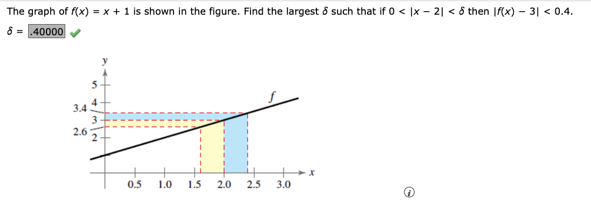

# Math 271 Test 1 Problems


## HARD LIST

2.2 #5,6  Worst, don't get.  Was able to do #6 practice another successfully though.
2.3 #12   More practice may sove
2.3 # 13  Do one or two more, it's OK, see below 1st
2.4 # 11 -- got right but don't understand why
2.5 # 4 is a trick question!  See below.  There's only one root that doesn't end up with 0/0.
2.5 # 5 vertical asymptotes of exponential functions, redo and redo practice another.

## For this section see notes 1/23/24

Find:

From class 9/23:

$$
\lim_{x \to 2}\space\frac{3}{x-2} 
$$

Tables are now easy, but rounding is an issue.

From 2.2

#1 Practice another

Find this limit with a table, round to 5 decimal places
$$
\lim_{x \to 0} \frac{9\space\sin x}{x}
$$

Use graph to find limit, with graph of vert asmyptote given.  Easy.

***HARD:***

The next two I really don't understand yet.  See class notes.  Try also [this video](https://www.bing.com/videos/riverview/relatedvideo?q=delta+epsilon+problems+limits&mid=EBAD444B69701B760B91EBAD444B69701B760B91&FORM=VIRE)

With jump $Left \neq Right$, easy.



Set 2.1 practice another for #6 gives

Consider the following limit:

$$ 
\lim \limits_{x \to 2} (6x + 2)
$$

  1. Find the limit
  2. Find $\delta > 0$ such that $|f(x) -L| < 0.01$ whenever $0 < |x -2| < \delta$.  Round to 5 decimal places.
  3. Find $\delta > 0$ such that $|f(x) -L| < 0.005$ whenever $0 < |x -2| < \delta$.  Round to 5 decimal places.


<!--
```{code-cell} ipython3
# Your code here
```
-->

2.2 # 8

What is $f(x) = 7$ as x approaches $\pi$?  Easy.

2.3 1-2 substitution limits, easy.

#3 practice another 

Easy, but do we need to show anything special for #3?

Given 
$$ 
f(x) = 2x^2 - 3x + 14,\space g(x) = \sqrt[3]{x + 4}
$$

Find:
  1. $\lim \limits_{x\to 3} \space f(x)$

  2. $\lim \limits_{x \to 23} \space g(x)$
  
  3. $\lim \limits_{x \to 3} \space g(f(x))$

2.3 # 6 practice another easy, not here.
    # 8 also easy, not here
    # 9 also easy.  This time needed to multiply by the conjugate.  Here's that problem.  Find:

$$
\lim \limits_{x \to 74} \space \frac{\sqrt{x + 7} - 9}{x - 74}
$$

## For this section see notes 1/24/24

2.3 # 10 practice another 

Find the limit or DNE.

$$
\lim \limits_{\delta x \to 0} \frac{5 (x + \delta x ) - 5x}{\delta x}
$$

Simplify and cancel to 5.  Fairly easy.

$$
\lim \limits_{x \to 0} \frac{\sin x}{8x}
$$

For this one fairly easy, recall special case of $\frac{\sin x}{x} = 1$

Number 12 Practice Another (Do via graph, table, and analytically)

REWORK this. Had issues.

Number 13 Practice Another:

Given $f(x) = 2x^2 - 3x$, find the limit as x approaches zero, given $\delta x = h$, 

$$
\lim \limits_{h ->0} \frac{f(x + h) - f(x)}{h} \\
$$

Note that the correct answer at the end of the day equals $f'$ or $\frac{dy}{dx} f$, so $4x - 3$, but done algebraically it's unclear when to finish crossing out.  It looks like you end up crossing off all the h terms, and whatever is left still multiplies by h goes away because you sub zero at that point, thus:

$$\frac{4xh + 2h^2 - 3h}{h} \\
\space\\
= 4x \cancel{h} + 2h - 3 \\
\space\\
= 4x - (2 \times 0) - 3
\space\\
\space\\
= 4x - 3
$$

2.3 # 14 easy enough.

2.3 Practice another #15:

$$
\lim \limits_{x \to 1} \space ln{(\frac{x}{e^{3x}})}
$$
Easy enough second time too.

On to exercise set 2.4

2.4 # 1,2,4,5,7,9,10,12,13,14 easy enough

Number 3 was this one:

$$
\lim \limits_{x \to \pi} 5 \cot(x)
$$

OK, DNE, can show from left and right using table to prove.

#6 Practice another:

Find the constant a such that fn is continuous on entire real number line.

$$
  f(x) = \begin{cases} 
  2x^2, \space \space \space \space x >= 1\\
  ax - 8, \space \space  x < 1
  \end{cases}
$$

Pretty easy -- set both sides equal @ 1 and substitue and solve.

Number 8
Describe intervals where fn is continuous:

$$
f(x) = \sec(\frac{\pi x}{8})
$$

Got wrong the first time, don't flip secant, just solve like this:

$$
\frac{\pi x}{8} = \frac{\pi}{2}, \frac{3 \pi}{2}, etc.
$$

Number 11 of 2.4 is this.  Find the limit if it exists).

$$
\lim \limits_{x \to 8-} \ln(8 - x)
$$

Got DNE.  Not sure how I got that though.  At $x=8$ that's certainly a problem, but approaching it?

WebAssign 2.5 reviewed 1/25

Easy ones are: 1, 2, 3 (easy, table), 6 a little thought but not bad,7.  8 not bad but heavy calculator.  9 easy, read problem. 10 easy (mass of a particle, fun.), 11, 12 easy problems that look hard with exponents. 13 and 14 easy.

3 Practice another for table practice

$$
f(x) = \frac{1}{x^2 - 25}
$$

Make table given:
-5.5
-5.1
-5.01
-5.001
-4.999
-4.99
-4.9
-4.5

Number 4 practice another:

$$ 
  h(t) = \frac{t^2 − 5t}{t^4 − 625}
$$

Answer given is only -5, not plus 5.  Why??  To make numerator non-zero?  Yes, remember $\frac{0}{0}$ is a removable discontinuity, not a vertical asymptote!

Section 3.1 reviewed 1/26

Easy: 
  1 was trivial but did two other "long" ways for fun (linear fn, slope is m term).  2 easy, also done in class.  

  3 was hard but relates to one done in class.  In class we did use the limit process (deriv definition) to find f' of $f(x) = \frac{1}{x -1}$.

Number 3:

Use the limit process to find the derivative of the function.

$f(x) = \frac{7}{x^2}$  Did this one today (1/26/24), do the next one.

Number 3 practice another:
Use the limit process to find the derivative of the function.

$f(x) = \frac{9}{x^2}$

4 practice another:
Find the equation of a tangent line to the given function at the point (4,2):

$f(x) = \sqrt{x}$

